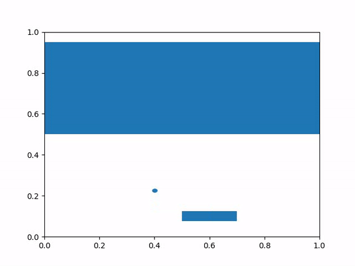

# Learn to play Breakout using Deep Q-Learning

This is an implemetation of Deep Q-Learning for the game breakout. See also this classical reinforcement learning paper
for more info: [Playing Atari with Deep Reinforcement Learning](https://www.cs.toronto.edu/~vmnih/docs/dqn.pdf).

This repository also comes with a full implementation of the breakout game with rendering done using Matplotlib.

## How to set up

### With Weights and Biases
Weights and Biases is a great tool for experiment tracking 📈. If you wanna use it, you can follow these steps:

1. Create an account with Wandb.
2. Get your API key, create a file wandb-key.txt
3. Make sure PyTorch, Numpy, matplotlib, weights&biases and ffmpeg are installed in your environment
4. Start `dql.py`. 
5. Do create some rendered rollouts of the game after training, you can execute `dql.py play`

### Without Weights and Biases

1. Make sure PyTorch, Numpy, matplotlib, weights&biases and ffmpeg are installed in your environment
2. Set `use_wandb` in `dql.py` to `False`
3. Start `dql.py`. 
4. To create some rendered rollouts of the game after training, you can execute `dql.py play`

### While training is running

If you're waiting for a model to train, just let time pass while playing some Breakout. Just run `play.py`.